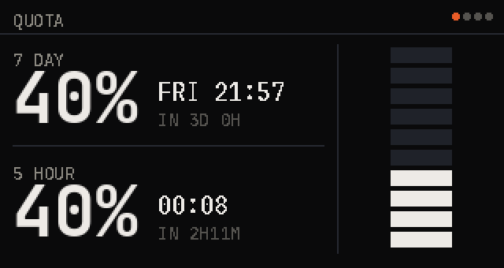
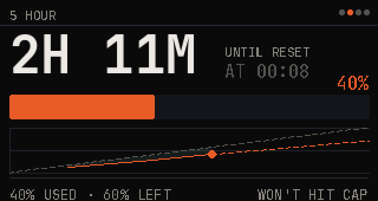
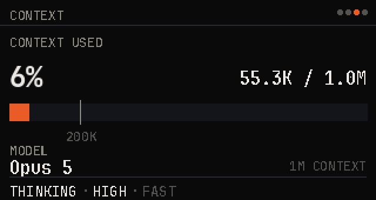
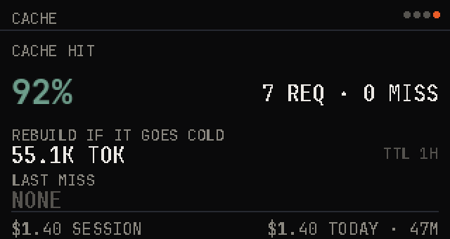
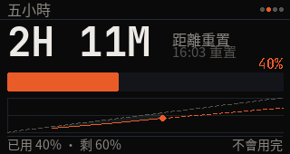
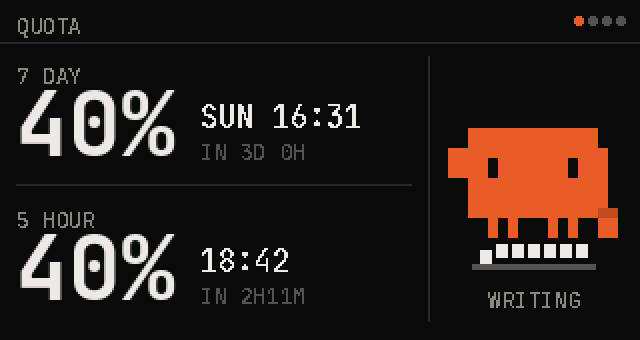

# Claude quota dashboard

[繁體中文說明](README.zh-TW.md)

A LilyGO T-Display-S3 on the desk showing how much Claude Code quota is left.



The host does all the work: it reads `~/.claude/usage-now.json` and
`usage-history.jsonl`, renders every pixel with Pillow, converts the rectangles
that changed to RGB565, and pushes them down the USB serial link. The firmware
is deliberately a dumb rectangle receiver, so changing the layout is saving a
file, not reflashing a board.

## The four pages

Button 1 goes back a page, button 2 forward.

| | |
|---|---|
| `QUOTA` — both quotas at a glance and when each clears | `5 HOUR` — countdown, bar, and the burn curve for this window |
|  |  |
| `CONTEXT` — context used against the window, with the 200K mark | `CACHE` — hit rate, what a cold rebuild would cost, spend |
|  |  |

Colour is the same everywhere: white up to 60%, orange to 90%, dark red past
that. Nothing is compared against a "you should be here by now" line -- a five
hour window refills on its own, and a weekly line just glows orange all week if
you work hard, which is no information at all.

Small text is drawn without anti-aliasing, because at this pixel pitch the grey
edge pixels are most of a glyph; the two large sizes keep it.

## Where the data comes from

Claude Code does not write those two files by itself. The status line hook is
the only thing that fires often enough, so `install/statusline-sampler.sh`
records the payload on every refresh and appends a sampled line to the history
log at most once every 30 seconds. **Without it the dashboard shows NO DATA
forever**, which is easy to install and hard to diagnose.

In `~/.claude/settings.json`:

```json
"statusLine": {"type": "command", "command": "~/claude-quota-dash/install/statusline-sampler.sh"}
```

Already have a status line you like? Keep it, and copy the block between the
`RECORD` markers in that script to the top of yours. It needs `jq`, it is
throttled by the log's own mtime, and every step of it is allowed to fail
silently, because nothing here may slow down your prompt.

The curves only have as much history as the log has lines, so the first day
looks sparse.

## Install

Hardware: a LilyGO T-Display-S3 (320x170, the plain non-touch one) and a USB-C
cable that carries data.

```bash
sudo apt install fonts-jetbrains-mono jq          # the layout is measured in this font
python3 -m pip install --user pyserial numpy Pillow
pio run -d firmware -t upload                     # PlatformIO, once
mkdir -p ~/.config/systemd/user
cp install/quota-dash.service ~/.config/systemd/user/
systemctl --user daemon-reload
systemctl --user enable --now quota-dash.service
```

Then set the status line as above and give it a minute to collect a sample.

**More than one ESP32 plugged in?** Every board with native USB-JTAG enumerates
as `303a:1001`, so they are indistinguishable except by the MAC in their
`/dev/serial/by-id` path. With exactly one the port is found automatically;
with two the daemon refuses to guess and lists what it found, and you point it
at the right one:

```ini
# ~/.config/systemd/user/quota-dash.service.d/port.conf
[Service]
Environment=QUOTA_DASH_PORT=/dev/serial/by-id/usb-Espressif_USB_JTAG_serial_debug_unit_AA:BB:...-if00
```

## Control

    quota page 1-4      jump to a page
    quota next / prev   same as the buttons
    quota bri 0-255     backlight
    quota crab on/off   the crab, see below
    quota lang en/zh    interface language, see below
    quota status        current page, backlight, crab, language

If the host dies the firmware drops the backlight to 10% after 30 seconds
without a frame. That is on purpose: the numbers left on the glass are stale,
and a bright stale number is a lie. A dim screen means check
`systemctl --user status quota-dash`.

## Chinese



`quota lang zh` puts the labels in Chinese, `quota lang en` puts them back, and
the choice survives a restart (it is the file `~/.config/quota-dash/lang`).
Numbers, clock times, units and the model name stay as they are -- they read the
same either way, and mixing two typefaces on one line costs more than it buys.

Chinese needs more pixels than Latin at the same nominal size: an 11px label is
a blot on a 1.9" panel. So labels grow to 16px and keep the soft edge that small
Latin has to do without, and because that height has to come from somewhere, the
three label-over-value stacks become single rows. It needs Noto Sans CJK
(Debian/Ubuntu: `apt install fonts-noto-cjk`).

## The crab



`quota crab on` replaces the column beside the numbers with a crab whose
posture follows the seven-day quota: claws up while there is room, sagging as
the week burns down, flat on the sand near the end. It breathes, blinks and
looks around. The setting sticks across restarts (it is a file at
`~/.config/quota-dash/crab`).

It is **off by default** because it is a fond, hand-drawn nod to Clawd, the
crab mascot of Anthropic, who make Claude. The pixels here are mine, drawn for
this screen, but the character is theirs. This project is not affiliated with
or endorsed by Anthropic.

## Reading further

`docs/PROTOCOL.md` is the wire format between host and board.
`reference/tdisplay-s3-facts.md` is the pin map and the display quirks,
verified against hardware -- if you are porting this to another panel, start
there, especially the parts about `TFT_INVERSION_ON` and byte order.

`python3 test_data.py` covers the parsing, and `python3 preview.py OUT_DIR`
renders every page from synthetic data so you can check a layout change without
a board on the desk.

## License

MIT, see `LICENSE`.
